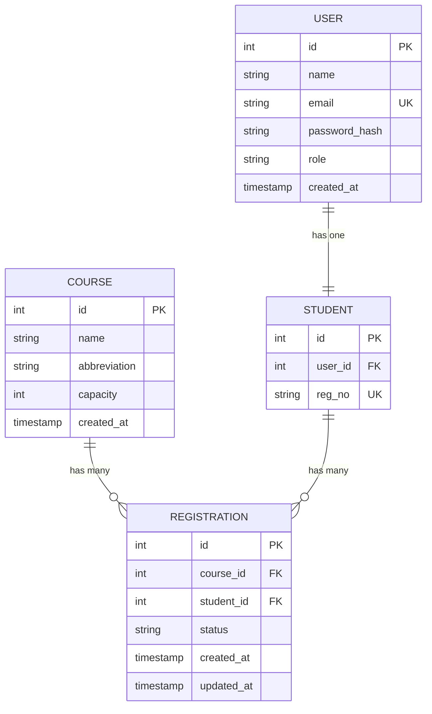

# Student Course Registration System

A production-style university course registration platform built with Node.js, Express, Prisma, and Supabase-compatible PostgreSQL.

## Project Structure

- `client/` - Static frontend assets (HTML, CSS, JS)
- `server/` - Express application entry point
- `controllers/` - API controller layer
- `routes/` - Route definitions
- `middleware/` - Express middleware and security
- `services/` - Business logic services
- `repositories/` - Data access layer
- `validators/` - Request and schema validation
- `config/` - Environment and application configuration
- `utils/` - Shared utilities
- `prisma/` - Prisma schema and migrations
- `docs/` - Swagger/OpenAPI and documentation assets
- `tests/` - Automated tests
- `public/` - Optional public static assets
- `uploads/` - File upload storage

## Database Design (ERD)

Below is the Entity-Relationship Diagram for our Student Course Registration System.

